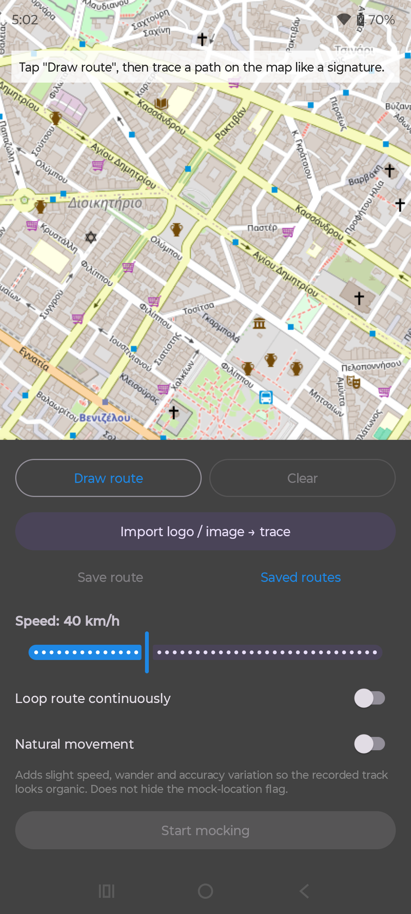
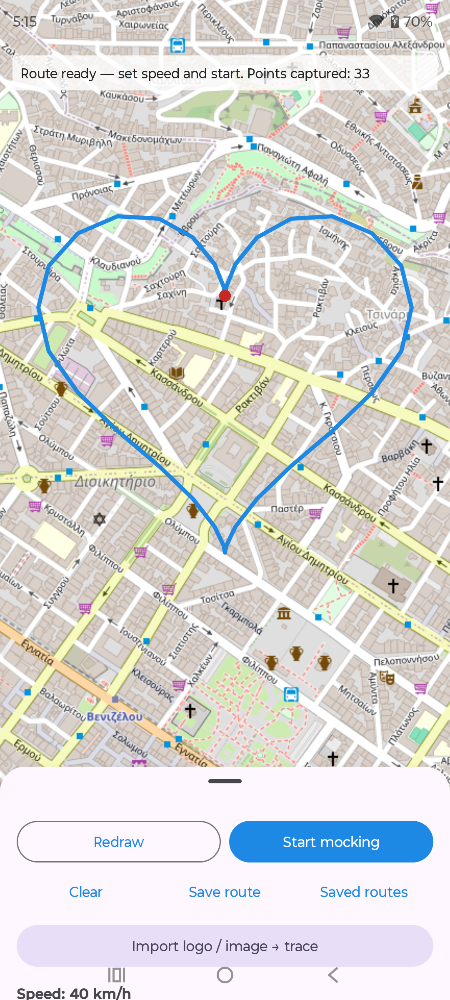
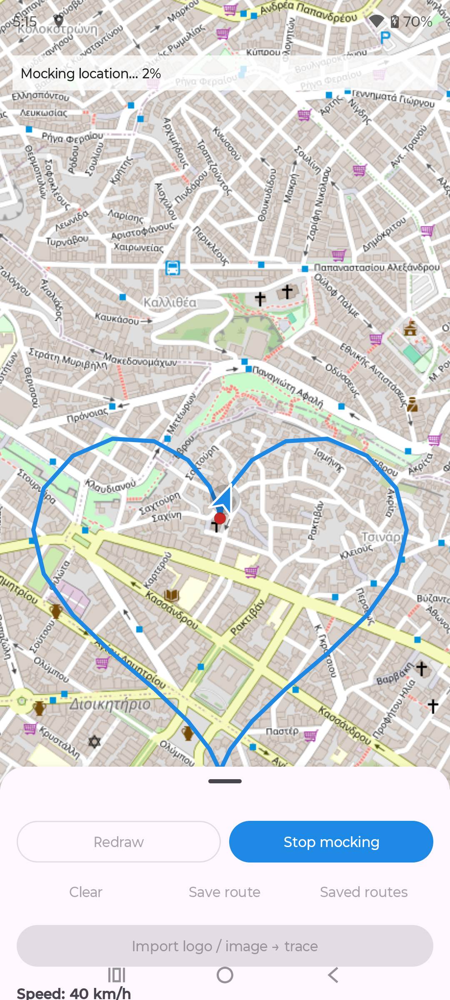
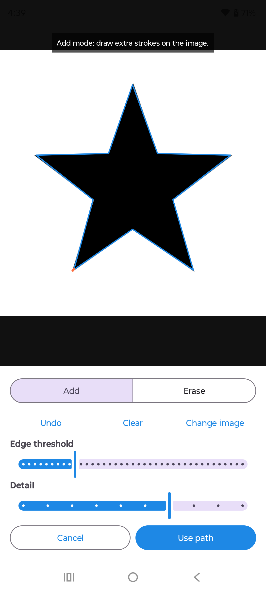
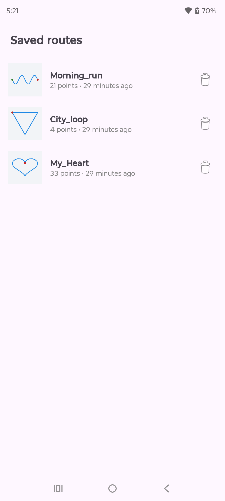

<div align="center">


# Mock Path

**Draw a route on a map — or trace a logo — and replay it as your Android GPS location.**


</div>

---

Mock Path turns a drawing into movement. Sketch a path on the map with your finger like a
signature, pick a speed, and the app feeds those coordinates to Android's location system so
every app on the phone — including your location history — sees you travelling along the shape
you drew. You can also import a logo or image, let the app edge-detect its outline, tidy the
result in a small editor, and mock *that* as your route.

It uses Android's official test-provider API (the same mechanism the emulator uses), so no root
is required — you just pick the app under **Developer options → Select mock location app**.

## Screenshots

<table>
  <tr>
    <td align="center"><br/><sub>Map & controls</sub></td>
    <td align="center"><br/><sub>Draw a route</sub></td>
    <td align="center"><br/><sub>Live playback</sub></td>
  </tr>
  <tr>
    <td align="center"><br/><sub>Logo → path</sub></td>
    <td align="center"><br/><sub>Saved routes</sub></td>
    <td></td>
  </tr>
</table>

## Features

- **Finger-draw routes** on an OpenStreetMap map — trace any shape like a signature.
- **Import a logo / image → trace it.** A multithreaded Sobel edge detector plus Zhang–Suen
  thinning turns the outline into a clean single-line path.
- **Path editor** with *Add*, *Erase* and *Move* tools, plus edge-threshold and detail sliders
  to re-trace on the fly.
- **Realistic playback** at a chosen speed (km/h). Positions are interpolated along the path and
  a direction arrow shows the current heading.
- **Feeds the fused provider too**, so Google Maps Timeline and other apps pick up the mock.
- **Save & reload routes** with a name and a shape preview thumbnail.
- **Natural movement** (optional) — adds slight speed, lateral wander and accuracy variation via a
  smooth random walk, so the recorded track looks organic instead of a robotic straight line.
- **Foreground service** with a live progress notification and a one-tap stop.
- **Loop mode** to repeat a route continuously.
- Edge-to-edge Material 3 UI that keeps content inside the safe area on modern phones.

## How it works

**Mocking.** A foreground service runs the playback loop on its own worker thread. It registers
GPS and network test providers via `LocationManager.addTestProvider`, then pushes an interpolated
fix once per second with `setTestProviderLocation`. It also calls
`FusedLocationProviderClient.setMockLocation`, which is what Google Play services / Maps Timeline
read. Distance travelled is derived from the elapsed time and the chosen speed, and the exact
lat/lon is interpolated along the drawn polyline.

**Logo tracing.** The picked image is downscaled, converted to grayscale, blurred, and run through
a Sobel gradient. The gradient is thresholded into a binary edge map and thinned with the
Zhang–Suen algorithm so each stroke collapses to a single-pixel line. A contour tracer walks the
connected pixels into polylines, simplifies them with Ramer–Douglas–Peucker, and chains them into
one continuous route that gets mapped onto the current map viewport.

All of the per-pixel image work is split into row bands and processed on a thread pool sized to the
device's CPU count.

## Getting started

### Requirements

- Android Studio (recent stable) and an Android device running **Android 8.0 (API 26)** or newer.
- USB debugging enabled on the device.

### Build & run

```bash
git clone https://github.com/orestislef/mock-path.git
cd mock-path
# open in Android Studio and Run, or from the command line:
./gradlew installDebug
```

### Enable mock location

1. On the phone, enable **Developer options** (tap *Build number* seven times in *About phone*).
2. Open **Developer options → Select mock location app** and choose **Mock Path**.
3. Launch the app, draw or import a route, set a speed, and tap **Start mocking**.

The app checks whether it is the selected mock-location app before starting and, if not, offers a
shortcut straight to Developer options. Location and notification permissions are requested at
runtime; if something is missing the app explains what to do rather than crashing.

## Tech stack

- **Language:** Java, `minSdk 26`, `targetSdk 37`, AGP 9 / Gradle 9.
- **Map:** [osmdroid](https://github.com/osmdroid/osmdroid) (OpenStreetMap, no API key).
- **Location:** `LocationManager` test providers + Google Play services fused provider.
- **UI:** Material 3, edge-to-edge with `WindowInsets`.
- **Image processing:** custom multithreaded Sobel + Zhang–Suen thinning + contour tracing.

## Disclaimer

Mock Path is intended for development, testing, demos and personal experimentation. Only mock your
location where you are allowed to, and respect the terms of any app you use it with.

Note: Android tags every mock fix so apps can detect it via `Location.isFromMockProvider()`. The
**Natural movement** option only makes the *recorded track* look more realistic — it does **not**
hide that flag, and Mock Path makes no attempt to defeat anti-mock protections.

## License

Released under the [MIT License](LICENSE).
